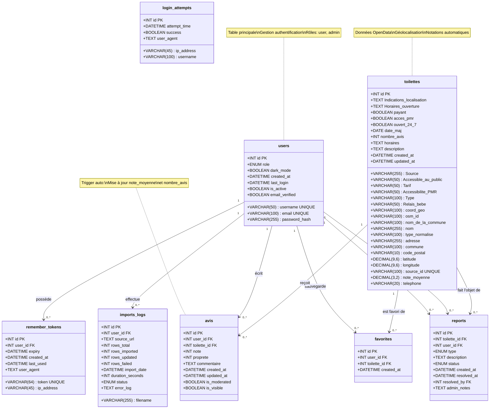

# Diagramme UML - Base de données PeePeeFinder

## Vue d'ensemble

Cette base de données gère une application de localisation de toilettes publiques avec système d'avis, de favoris et de signalements.

## Diagramme de classes UML

## Architecture en 3 niveaux

### Niveau 1 - Tables indépendantes (0 clé étrangère)
- **users**: Gestion des utilisateurs et authentification
- **toilettes**: Base de données des toilettes publiques (données OpenData)
- **login_attempts**: Logs de sécurité (anti-brute-force)

### Niveau 2 - Tables dépendantes simples (1 clé étrangère)
- **remember_tokens**: Tokens de session persistante (→ users)
- **imports_logs**: Historique des imports CSV (→ users)

### Niveau 3 - Tables de liaison (2+ clés étrangères)
- **avis**: Système de notation et commentaires (→ users + toilettes)
- **favorites**: Liste des favoris par utilisateur (→ users + toilettes)
- **reports**: Signalement de problèmes (→ users + toilettes + users.resolved_by)

## Triggers automatiques

La base de données inclut 3 triggers pour maintenir automatiquement les statistiques:

1. **update_note_moyenne_after_insert**: Recalcule la note moyenne après ajout d'un avis
2. **update_note_moyenne_after_update**: Recalcule la note moyenne après modification d'un avis
3. **update_note_moyenne_after_delete**: Recalcule la note moyenne après suppression d'un avis

## Vues statistiques

4 vues sont disponibles pour faciliter les requêtes:

- **stats_globales**: Statistiques générales du système
- **toilettes_top_rated**: Top 20 des toilettes les mieux notées
- **stats_par_commune**: Statistiques agrégées par commune
- **user_activity**: Activité des utilisateurs (avis, favoris, signalements)

## Procédures stockées

2 procédures de maintenance:

- **clean_old_login_attempts()**: Nettoie les logs de connexion > 30 jours
- **clean_expired_tokens()**: Supprime les tokens expirés

## Relations détaillées

| Table source | Table cible | Cardinalité | Type | Action CASCADE |
|--------------|-------------|-------------|------|----------------|
| users | remember_tokens | 1:N | possède | ON DELETE CASCADE |
| users | imports_logs | 1:N | effectue | - |
| users | avis | 1:N | écrit | ON DELETE CASCADE |
| users | favorites | 1:N | sauvegarde | ON DELETE CASCADE |
| users | reports (user_id) | 1:N | signale | ON DELETE SET NULL |
| users | reports (resolved_by) | 1:N | résout | ON DELETE SET NULL |
| toilettes | avis | 1:N | reçoit | ON DELETE CASCADE |
| toilettes | favorites | 1:N | est favori de | ON DELETE CASCADE |
| toilettes | reports | 1:N | fait l'objet de | ON DELETE CASCADE |

## Contraintes d'unicité

- **users**: username, email
- **toilettes**: source_id
- **remember_tokens**: token
- **avis**: (user_id, toilette_id) - Un utilisateur ne peut noter qu'une fois une toilette
- **favorites**: (user_id, toilette_id) - Un utilisateur ne peut favoriser qu'une fois une toilette

## Index pour performance

Tous les champs fréquemment recherchés sont indexés:
- Recherche géographique: (latitude, longitude)
- Recherche multicritères: (commune, acces_pmr, payant, ouvert_24_7)
- Tri par note: note_moyenne
- Sécurité: (ip_address, attempt_time)

---

**Version**: 2.1
**Date**: 2025-11-08
**Moteur**: InnoDB
**Charset**: utf8mb4_unicode_ci
